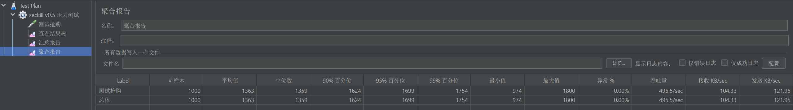
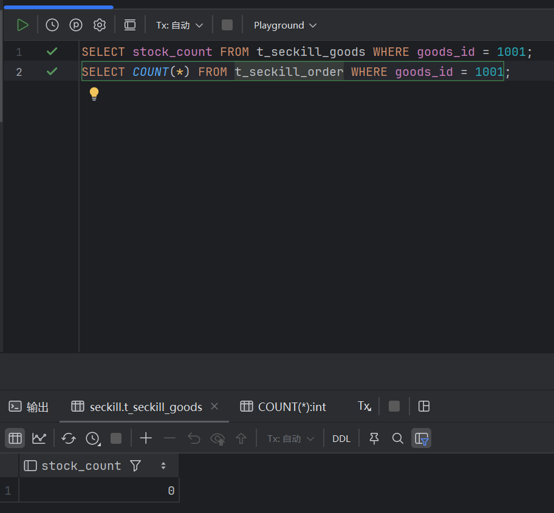
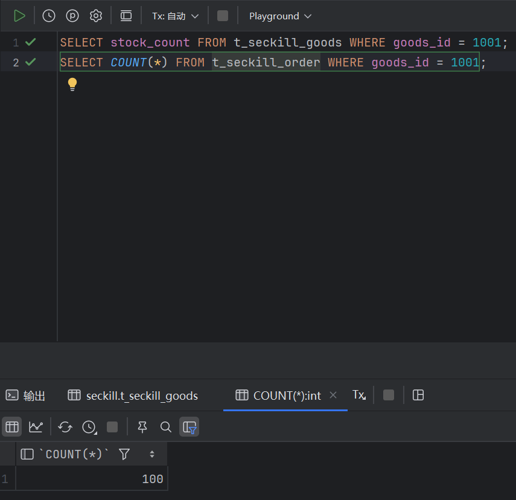

# V0.5 基础班秒杀压测复盘报告

## 1. 测试环境与基本参数
- **压测工具**：Apache JMeter
- **并发策略**：1000个线程，1秒内全部启动 (Ramp-Up = 1)
- **初始数据**：1000个测试用户，秒杀商品库存设为 10 台。

## 2. 压测结果分析

### 2.1 表面现象：虚假繁荣的吞吐量

* **表现**：TPS 达到 495.5/sec，异常率（Error %）为 0.00%。
* **结论**：因为没有加锁排队及任何限流措施，请求长驱直入，未发生阻塞响应较快。

### 2.2 浅层问题：库存清零不彻底

* **表现**：库存并没有因为过度并发变成负数，而是停在了 0。
* **结论**：代码层面的 `if (stock < 1)` 拦截生效了，但未能防住并发洪峰，真正的灾难在订单表里。

### 2.3 核心灾难：严重超卖 (Lost Update)

* **表现**：预设 10 台库存，实际生成了 100 条秒杀成功订单，发生极其严重的超卖问题。
* **根因分析（并发更新丢失）**：
  高并发下，大量线程集体查询数据库，此时库存均显示够用（比如都拿到 stock=10），全部通过了 Java 内存的 IF 拦截验证。随后这些线程并发向数据库发送 `UPDATE stock = 9`。数据库实际被更新了上百次，但库存值只扣减了1，导致大量线程自认为“抢购成功”并插入了订单记录。
  这就暴露了完全脱离原子性操作的致命漏洞。

## 3. 下一步优化方案规划 (V1.0)
引入 Redis 高性能缓存与 Lua 脚本机制，摒弃数据库直连更新，在内存层面通过强原子性操作完成库存预扣减，彻底杜绝并发写覆盖造成的超卖事故。