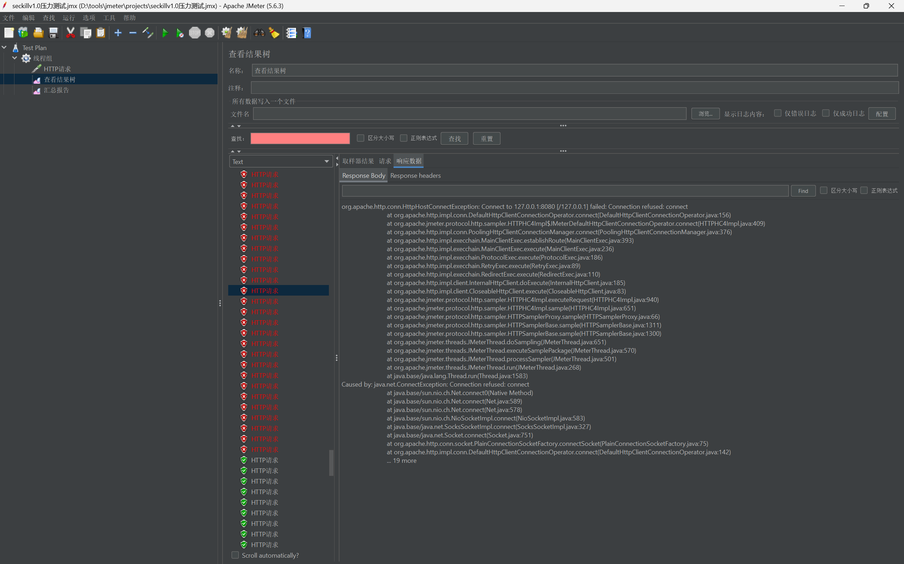
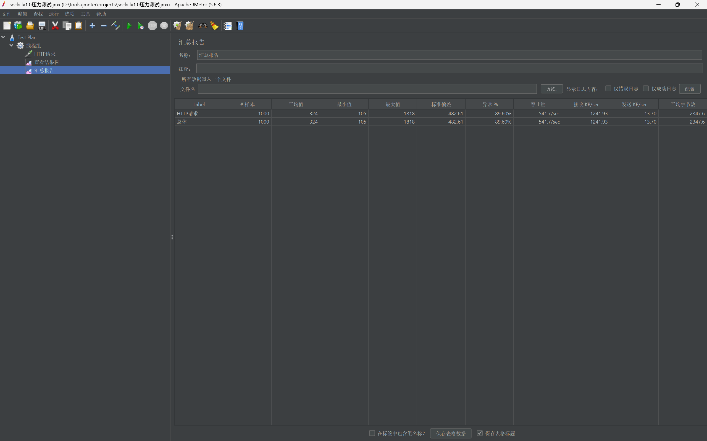
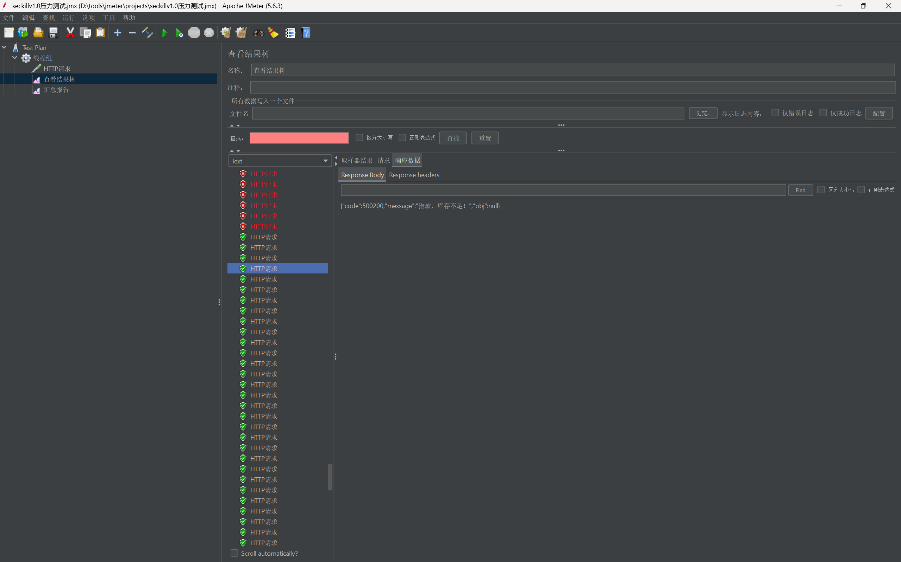
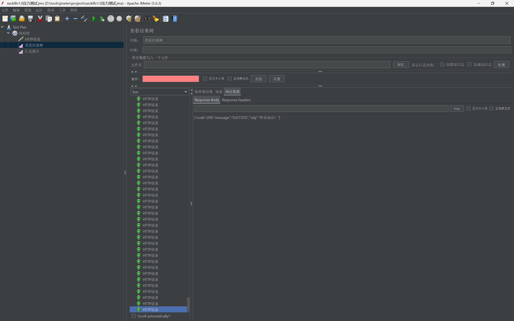
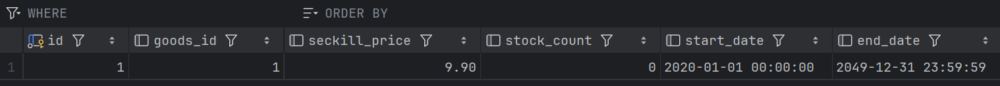
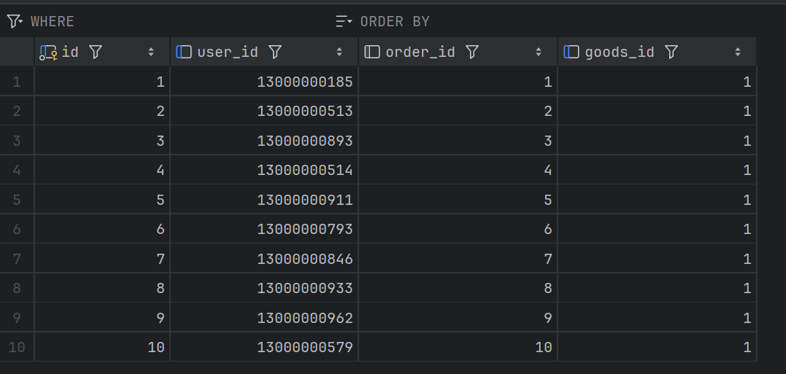
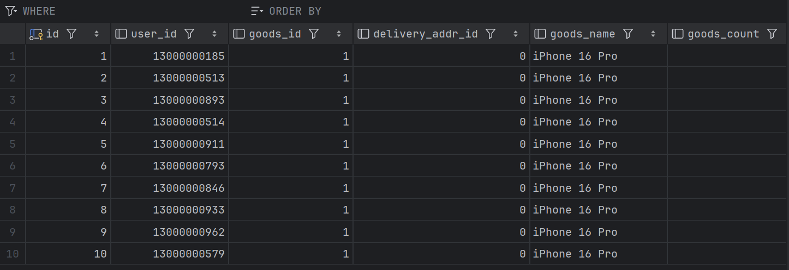

# V1.0 进阶版秒杀压测复盘报告 (Redis+Lua)

## 1. 测试环境与基本参数
- **压测工具**：Apache JMeter
- **并发策略**：1000个线程，单机 0 秒内瞬时启动 (极高瞬发并发)
- **初始数据**：1000 个测试用户；预设秒杀活动专属库存 10 件，常态总库存 100 件。

## 2. 压测结果分析

### 2.1 基于网关与协议层的表现：假象的 "绿✅" 与 TCP 拥塞

* **表现 1 (Connection Refused)**：由于千人瞬时并发冲击单机环境，超出了内置 Tomcat 默认 TCP 独立等待队列的极限，部分请求在操作系统网络层被直接拒绝，这属于未做服务器调优前的正常物理现象。
* **表现 2 (HTTP与业务状态分离)**：JMeter 中存在大量 HTTP 状态码为 `200 OK`（标绿）的请求。但实际上，这些请求的 JSON 响应体中包含了自定义业务异常码 `{"code": 500200, "message": "库存不足"}`。系统成功做到了在 HTTP 无异常通信的前提下，通过业务代码大批量拦截拦截多余流量。

### 2.2 核心战役胜利：0 超卖的完美防御与库存隔离

* **表现**：
    1. `t_seckill_goods` 秒杀库存精准下降至 `0`，未出现任何负数。
    2. 原生 `t_goods` 的 `100` 件常态库存未发生误扣减（完全解耦）。
    3. `t_seckill_order` 精确生成、且仅生成了 `10` 条秒杀订单数据。
* **根因分析（防插队与资格发放机制）**：
  相比于 V0.5 在数据库段的无序混战，V1.0 将“查库存+扣库存”这一极易引发并发症（Lost Update）的动作，打包进 Redis 的 Lua 脚本中执行。借助 Redis 单线程的高速处理能力，实现了“发号资格”的绝对原子性。不仅彻底切断了并发插队的可能，更将底层 MySQL 面临的写并发压力从 1000 锐减到 10，物理保护了数据库。

## 3. 面临的瓶颈与下一步规划 (V2.0)

**V1.0 留下的性能隐患：**
虽然 V1.0 完美拦截了 990 个过载请求，保护了数据准确性。但那 **10 个抢到资格的请求，依然在通过 Tomcat 同步调用 Java 线程直接写入 MySQL（生成订单）**。
若并发体量放大（如放出 10 万个资格），这 10 万个拿到了“通行证”的请求依然会一拥而上，瞬间霸占 Tomcat 的所有工作线程，并榨干 MySQL 数据库的可连接数与 CPU IO，最终造成服务宕机。

**V2.0 进阶演进方案 (异步削峰)：**
下一步计划引入 **RabbitMQ** 消息中间件构建缓冲层。
- **目标**：在前端 Redis Lua 校验通过后，立即打包一条包含 `(用户ID, 商品ID)` 的短小消息投递至 MQ 队列，并直接向前端返回“正在排队中”。
- **价值**：彻底断开 Controller 至 MySQL 的直连同步羁绊，由后台隐蔽的闲置集群慢慢从 MQ 拉取消息，以数据库 100% 舒适的节拍处理订单入库。从而达成**系统高可用防线**的最后一块拼图。