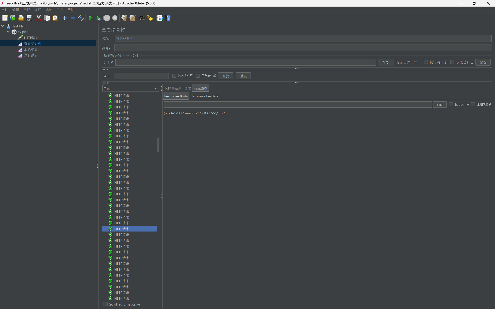
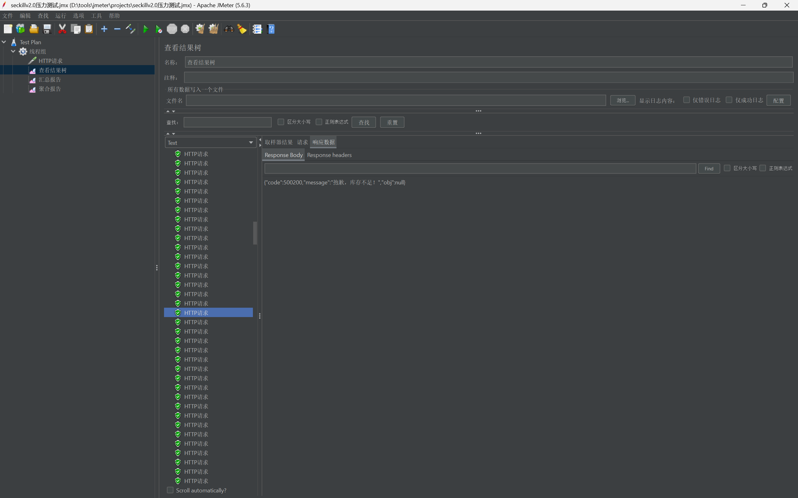
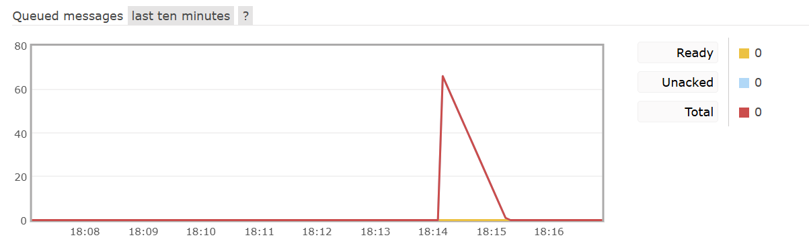
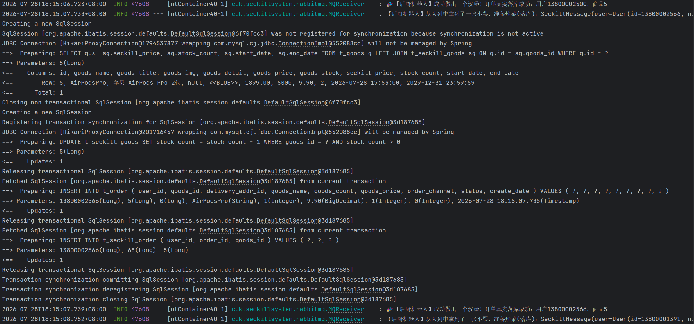
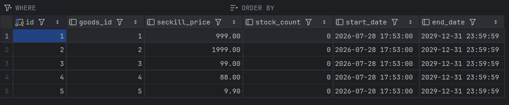
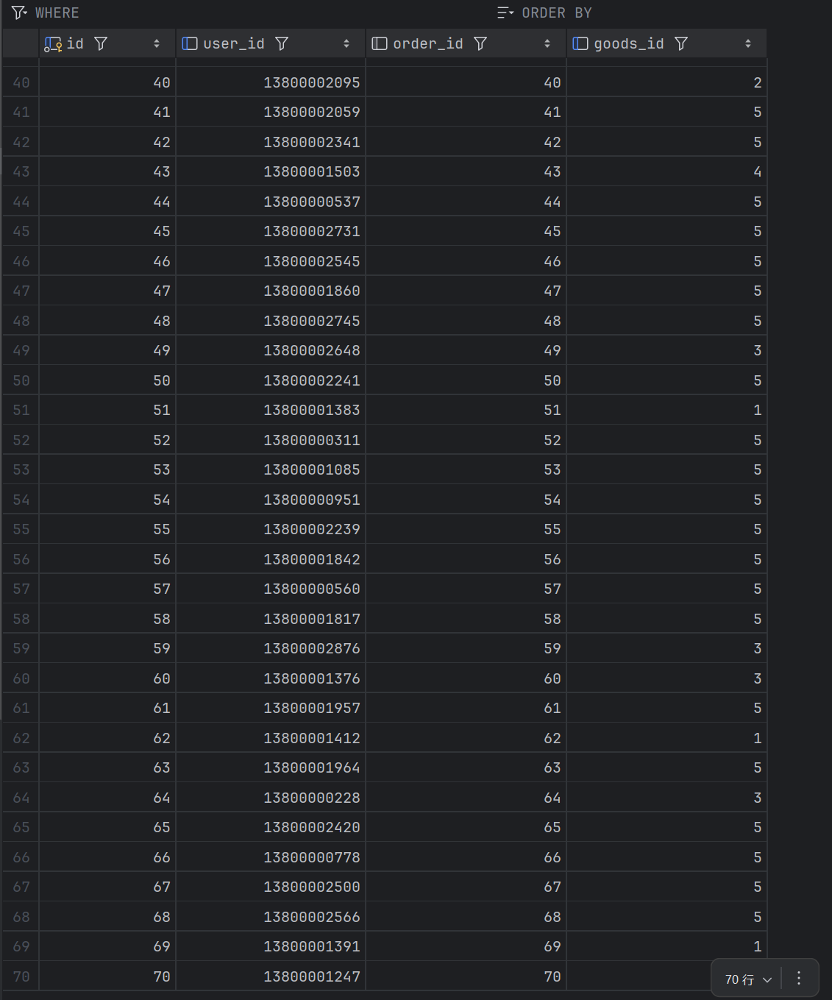

# V2.0 压测复盘报告 (Redis+RabbitMQ 异步削峰)

## 1. 测试环境与基本参数
- **压测工具**：Apache JMeter
- **并发策略**：3000 个线程，极短时间瞬时发动（模拟 3000 用户同时轰炸同一接口）
- **初始数据**：3000 个测试用户，参与秒杀的商品共 5 款，初始秒杀库存分别为（5, 2, 10, 3, 50），**总有效库存共计 70 件**。

## 2. 压测结果分析

### 2.1 流量拦截与快速响应 (Redis 层的胜利)

* **表现**：
  在《察看结果树》中，系统快速返回了两种核心状态：
    1. `{"code":200, "message":"SUCCESS", "obj":0}`：这代表那 70 个跑赢了 Redis 的幸运儿，拿到了“排队资格”（obj:0 往往代表前端显示处于排队结算状态）。
    2. `{"code":500200, "message":"抱歉，库存不足"}`：代表绝大部分被 Redis 瞬间拦在门外的过载请求，以极低的系统开销被直接退回。
* （注：JMeter 聚合报告中出现约 56% 的 Error 异常率，系因瞬时 3000 并发直接打在单机 Tomcat 上，超出了 Tomcat 默认的最大线程池限制，底层网络层主动丢队。这进一步证明了单机 HTTP 承受力有物理极限，而我们后端的保护策略非常必要。）

### 2.2 核心奇观：RabbitMQ 完美实现“削峰填谷”

* **表现**：
  随着压测开启，RabbitMQ 监控大盘瞬间出现了一座高峰：**Ready 队列的积压消息数飙升并精准停在 70 条**（正好等于 5 款商品的总库存数 70），随后这条曲线平缓地、匀速地下降。
  同时查看控制台日志可以看到，`MQReceiver`（后厨机器人）正在以绝对安全、从容的节奏（设计为每秒 1 个），平滑地从队列中取出订单，执行复杂的 MySQL 库表校验、扣库存及订单写入操作。
* **结论**：
  **这正是秒杀系统最核心的价值体现！** 3000 并发的洪峰流量被死死挡在缓冲池里，底层 MySQL 数据库面临的最大瞬时并发写压力从 3000 骤降为 1（或几个），彻底免于宕机崩溃的危险。

### 2.3 战役大捷：最终一致性 (0 超卖)

* **表现**：
  当 RabbitMQ 队列被全部消化完毕后，查阅 MySQL 底层数据：
    1. `t_seckill_goods` 表中，5 款商品的 `stock_count` 精准降至 `0`，没有一丝一毫的负数。
    2. `t_seckill_order` 表中，数据行数精准为 `70` 行。抢购成功的订单数与释放出去的实际库存数严丝合缝，分毫不差。
* **结论**：
  系统在承受了远超库存容量 40 倍的恶劣并发攻击下，打出了一场“零超卖”、“零宕机”的完美防御战。业务上达成了状态的最终一致性。

## 3. 架构演进总结 (V0.5 -> V1.0 -> V2.0)
通过本次压测，项目的高可用秒杀闭环正式打通：
- **V0.5 (裸奔时代)**：裸连 MySQL 进行 `UPDATE`，引发严重的并发更新覆盖（Lost Update），导致大量超卖。
- **V1.0 (Redis 拦水大坝)**：引入 Redis + Lua 脚本保证预扣减的原子性，隔离了上千并发，解决了超卖。但仅存的合法请求仍同步直连 MySQL 创建订单，存在隐患。
- **V2.0 (MQ 异步化底座)**：引入 RabbitMQ 斩断了应用层与数据层最后的同步羁绊。将瞬时的流量尖刺转化为平滑的处理队列。前端极速响应，后端从容落库，系统至此已具备企业级秒杀架构的核心骨架。