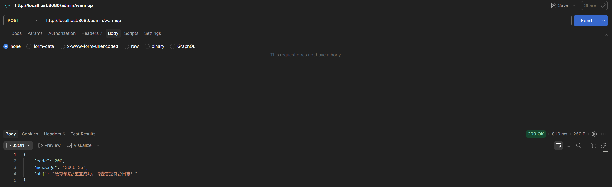
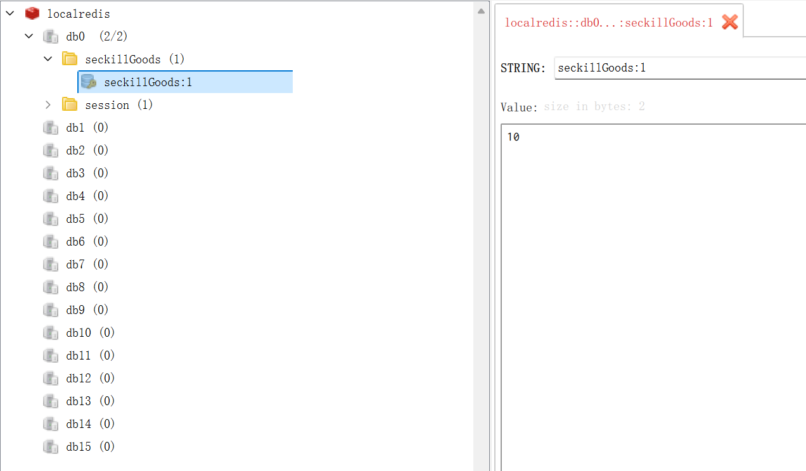
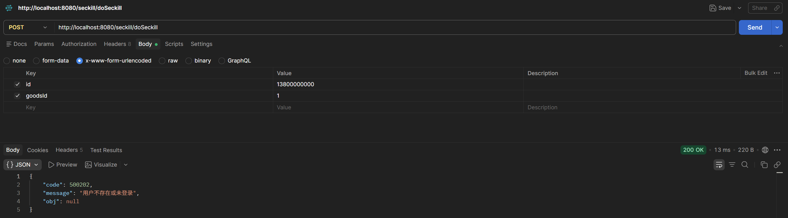
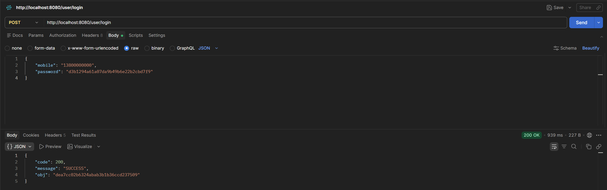
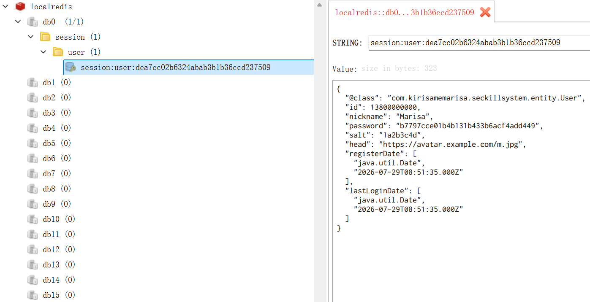
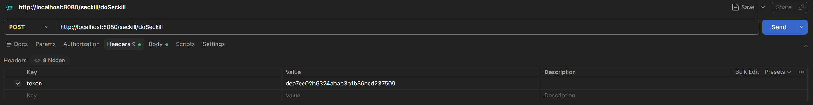
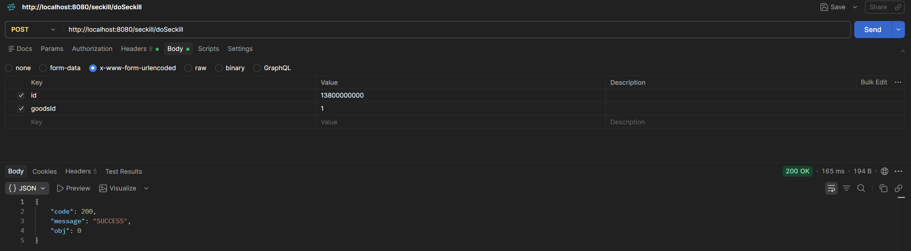
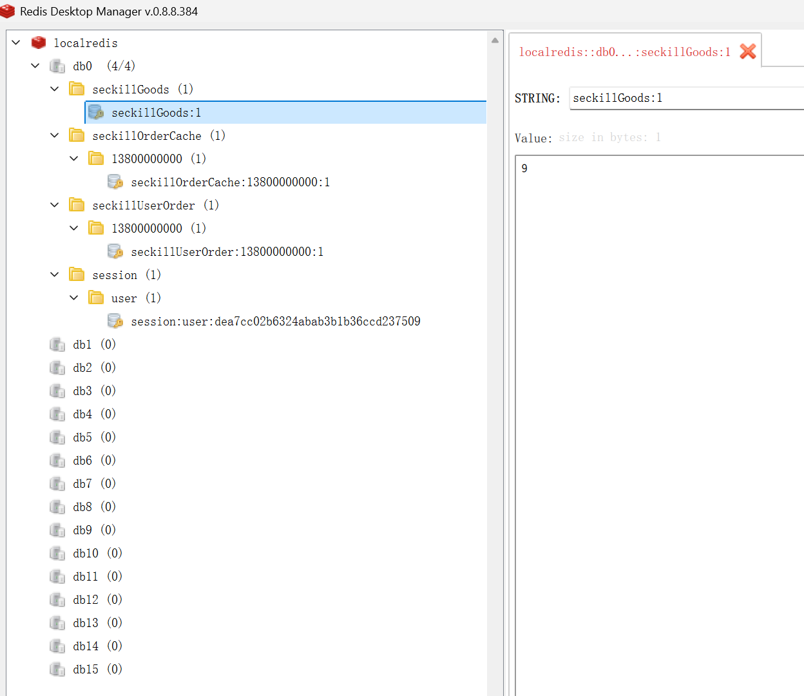
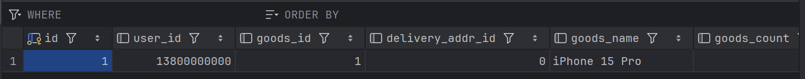
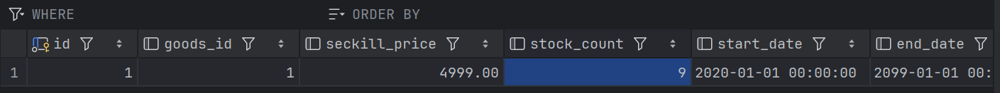

# V3.0 测试与检验报告 (分布式会话与企业级安全防御版)

## 1. 测试环境与核心里程碑
在 V2.2 解决了海量并发洪峰和宕机容灾的基础上，本 V3.0 版本的核心目标是彻底解决系统“裸奔”问题，实现**“隔离运营端与高并发 C 端”**、**“防范身份伪造与越权攻击”**以及验证**“全局身份解析与幂等拦截”**。

- **验证场景 A (隔离与预热)**：B 端运营后台动态重置库存，C 端接口纯净接客。
- **验证场景 B (安全与防伪)**：双重 MD5 密码校验，采用去中心化 UUID Token 替代传统 Session。
- **验证场景 C (AOP防刷与幂等)**：全局参数解析器无感拦截未授权访问，严格验证一人一单限制。

---

## 2. 战役一：B端运营与平滑缓存预热 (业务逻辑物理隔离)

### 2.1 告别随程序启动的硬编码

* **前置动作**：废弃了 `InitializingBean` 强制随项目启动加载数据的落后机制。改由运营管理专线 (`/admin/warmup`) 进行动态触发。
* **表现**：通过 POST 管理员接口后，MySQL 中的 10 件 `iPhone 15 Pro` 库存数据被精准且平滑地加载到了 Redis (`seckillGoods:1`) 中。这做到了运营侧操作与 C 端高并发通道的物理隔离，支持随时动态加库存。

---

## 3. 战役二：零信任安全与身份防伪校验 (金钟罩成型)

在旧版本中，黑客仅需利用 `?id=别人手机号` 即可实现盗用身份抢购。V3.0 引入了极其严密的零信任防线。

### 3.1 拦截黑客裸奔与伪造攻击

* **防线触发**：在未使用 Token 的情况下，黑客直接发送 `userId=13800000000` 试图抢单。
* **拦截判定**：SpringMVC 全局参数解析器（`UserArgumentResolver`）接管了请求。由于 Header 中无合法 Token，解析器直接向底层注入 `null`，瞬间被系统以 `500202: 用户不存在或未登录` 踢回。越权攻击彻底失效。

### 3.2 颁发合法令牌 (双重 MD5 与 Token 集群化)

* **登录换牌**：合法用户上传前台加密后的密文，后端结合该用户私有的 `Salt` 进行第二重 MD5 处理，比对通过后颁布唯一 UUID 凭证。
* **凭证下沉**：Token 连同用户完整实体被序列化打入 Redis（`session:user:dea7cc...`）。至此，系统彻底解除了对单点 Tomcat 内存 Session 的依赖，达成了可横向扩容的真正“微服务化”登录。

---

## 4. 战役三：正规军实弹演习与“一人一单”绝对防御
前提：初始抢购商品库存是10件，第一次试验测试已经创建了一个13800000000用户抢购goodsId为1的商品，所以库存为9是正常的，再次创建重复订单保持9不变

### 4.1 无感鉴权与合法放行

* **表现**：用户将颁发的 Token 注入 `Header` 再次发起抢购，系统底层 AOP 解析器瞬间从 Redis 提取用户身份并隐式传入 Controller。
* **结果**：成功拿到秒杀资格，返回 `0` 排队中，请求顺利进入 RabbitMQ 削峰通道。

### 4.2 幂等性与防重刷极限校验 (重复订单零容忍)

* **极端测试场景**：同一用户利用合法 Token 对同一商品发起多次并发扣减请求。
* **拦截剖析**：由于首次抢购成功时，Redis Lua 脚本凭借其绝对的原子执行能力，已经刻下了 `seckillUserOrder:13800000000:1` 的凭证。面对随后的重复请求，脚本直接抛出 `2` (重复抢购)。
* **最终核对**：
    1. Redis 缓存库存锁定在 `9`，没有被多扣一分。
    2. 数据库 `t_order` 表中仅仅干净地躺着 **1 条** 订单记录。
    3. 数据库 `t_seckill_goods` 的真实库存安全核减为 `9`。
       —— **一人一单机制 100% 达成！**

---

## 5. 架构演进总结 (V2.2 -> V3.0 通关)

如果在 V2.2 版本系统练得了一身抗压抗摔的“外家硬功”（Redis+RabbitMQ高并发削峰/防丢单），那么本次的 V3.0 就是彻底打通了“任督二脉”的**核心内功**：

1. **从敞口系统走向企业级安全闭环**：淘汰了危险的明文参数传递，建立了完善的 AOP Token 防火墙。
2. **从单点故障走向分布式集群支撑**：利用 Redis 重构了会话管理，这意味着未来如果我们把后端的 SpringBoot 直接扩展到 10 台、100 台服务器，用户的登录态也绝不会丢失。
3. **从耦合走向隔离**：强制隔离了高管运营台与 C 端流量池。

至此，一个兼具了千万级抗并发、断电级别容灾、以及防伪防刷的**工业级秒杀底座**，已宣告全面交付。