# V4.0 接口安全防刷与动态路由机制测试及检验报告

##  测试背景与目的
在 V3.0 的基础鉴权之上，为防止黑客/黄牛通过脚本大批量刷单（重放攻击）或提前知晓接口地址进行恶意高并发请求，V4.0 引入了**图形验证码前置校验**与**秒杀接口地址动态隐藏**两项核心安全机制。
本报告旨在验证：
1. 验证码机制是否能正确生成、存储、过期销毁，并有效拦截错误请求。
2. 动态路由机制是否能有效隐藏真实下单接口，拦截恶意绕过及伪造的路径请求。
3. 携带正确凭证的合法用户，是否能顺利全链路完成抢购并保证数据一致性。

---

##  第一阶段：图形验证码机制攻防测试

### 1.1 成功获取算术图形验证码
发起 `GET /seckill/captcha` 请求后，系统成功生成算术题图形验证码（如图示为 `6 - 7 = ?`）。
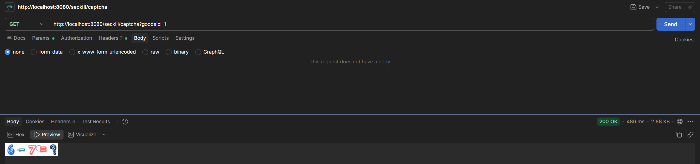

同时，后端自动计算出结果（如 `"-1"`），并将其带有 60 秒 TTL 存入 Redis，确保验证码时效性。
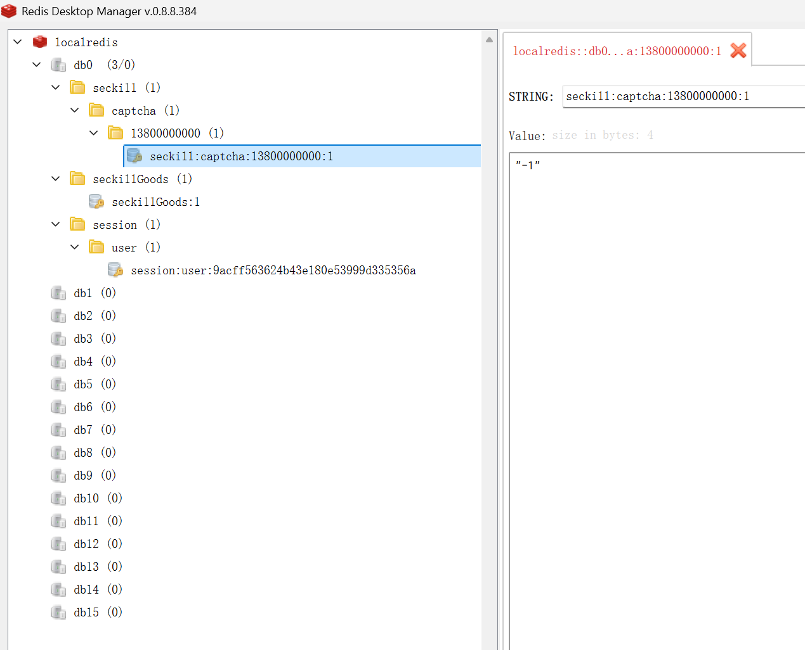

### 1.2 异常拦截实测一：错误验证码拦截
模拟攻击者瞎蒙答案或输入错误验证码（如传 `captcha=99`），请求获取秒杀路径。
系统成功命中校验异常分支，精准返回 `500204 验证码错误，请重新输入`，拒绝发放通过令牌。
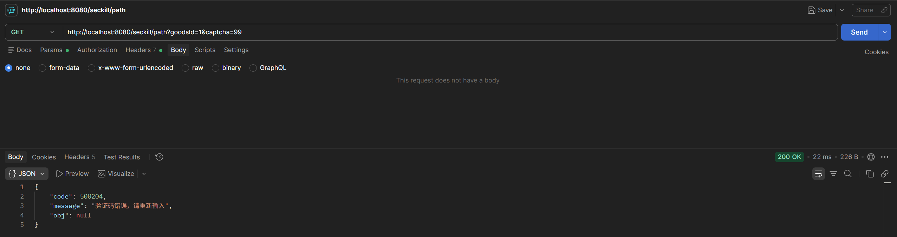

### 1.3 异常拦截实测二：验证码超时失效拦截
设定 60 秒后再次检查 Redis，发现对应的验证码 Key 已被系统自动销毁（抛出不存在警告）。
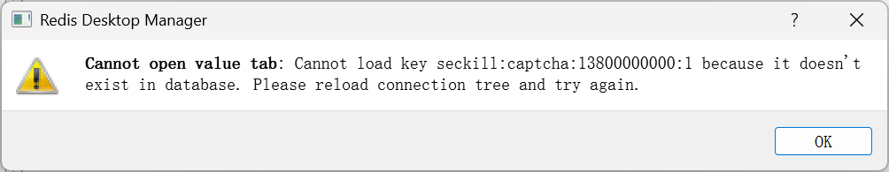
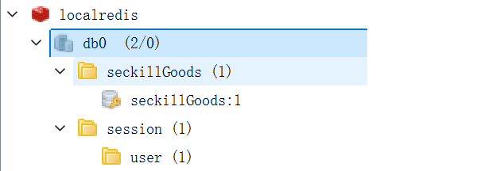

此时拿着原本正确的答案再次请求系统，系统判断缓存中无此记录校验不匹配，同样予以标准拦截操作，防止验证码被重复利用（重放攻击）。
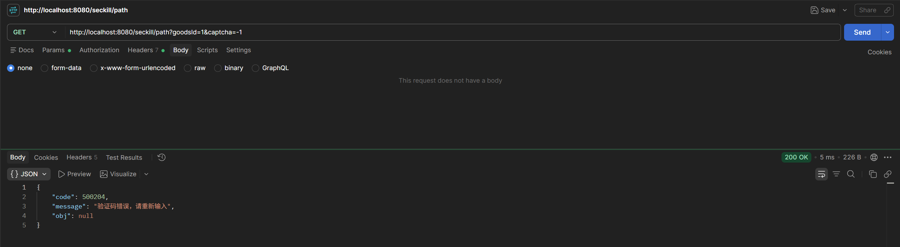

---

##  第二阶段：动态秒杀路由接口攻防测试

### 2.1 成功换取合法动态路径
在 60 秒时效内，携带正确的图形验证码答案发起请求，系统校验成功后，随即向客户端下发一条随机的、无规则的 UUID 真实秒杀地址（下图中 `obj` 字段对应的动态令牌）。
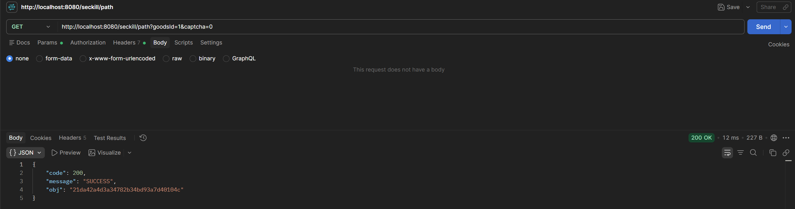

### 2.2 恶意绕过实测一：直接攻击老接口
黑客试图绕开验证码前置业务，直接请求常规的固定接口地址 `POST /seckill/doSeckill`。
由于我们对后端的 `@RequestMapping` 进行了动静态分离改造，老接口已被彻底废弃，系统直接由 SpringMVC 层返回 `404 Not Found` 阻断该类无脑脚本。
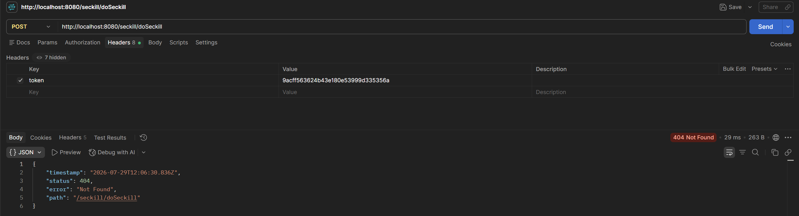

### 2.3 恶意绕过实测二：撞库伪造非法路径
黑客试图自己编造一串 UUID 并拼接入 URL（如 `/seckill/fakePath12345/doSeckill`）发起强行攻击。
系统在拦截层比对 Redis 中存储的用户授权 Path，由于不一致，直接抛出我们自定义的安全阻断：`500203 请求非法或频繁，请重试`。
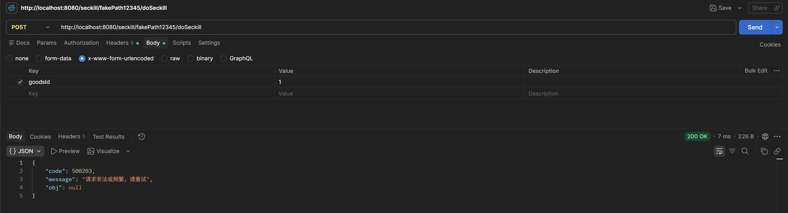

---

##  第三阶段：全链路抢购闭环与一致性检验

### 3.1 凭证合法下的高并发秒杀发车
在时效内，将获取到的真实动态 UUID（`21da42a4d3a34782b34bd93a7d40104c`）成功拼接进下单请求路径并发送。
请求合法通过所有安全关卡！系统将请求交由 RabbitMQ 异步处理，成功向前端返回状态码 `obj: 0`（排队中状态）。
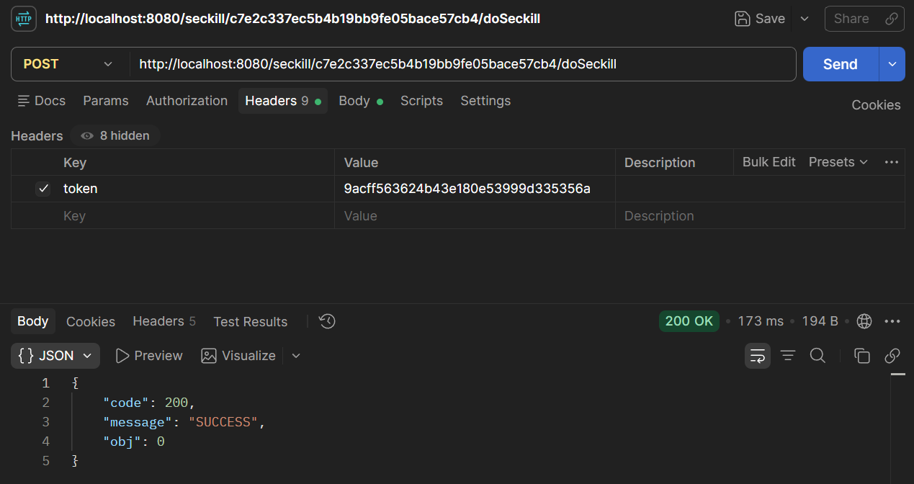

### 3.2 最终链路数据一致性校验
在经过 Redis 预扣减、MQ 流量削峰、消费者异步落库三大件的轮转后，核对最终系统数据：
- **Redis 缓存实时一致性**：预热库存成功减少1件（当前从 10 变为 9）。
  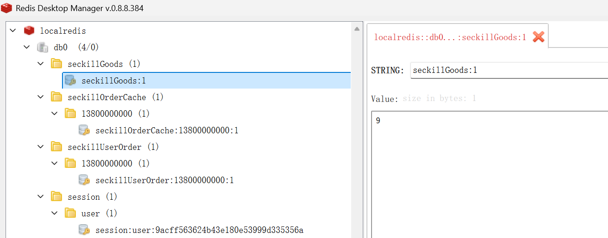
- **MySQL 数据库强一致性**：底层库存安全扣去1件（当前剩余 9），与 Redis 保持完全同步。
  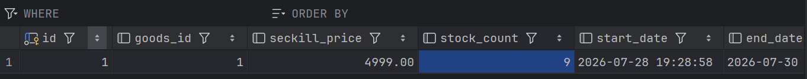
- **唯一订单落库校验**：`seckill_order` 数据表中成功生成了一条属于该用户的 iPhone 15 Pro 订单凭据。
  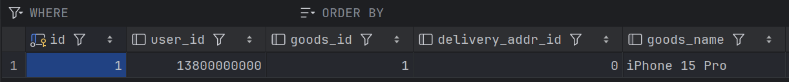

##  测试结论
经严密测试，V4.0 更新有效修补了以往固定秒杀接口容易被外挂锁定的短板，**图形验证码强行加入人工计算门槛**联合**极短有效期的动态路由防放重机制**构建了极强的防刷闭环，达到企业级生产项目抗黑客要求。全链路秒杀功能流转一切正常。