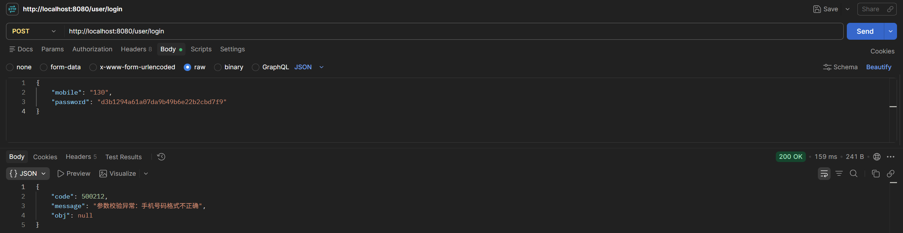
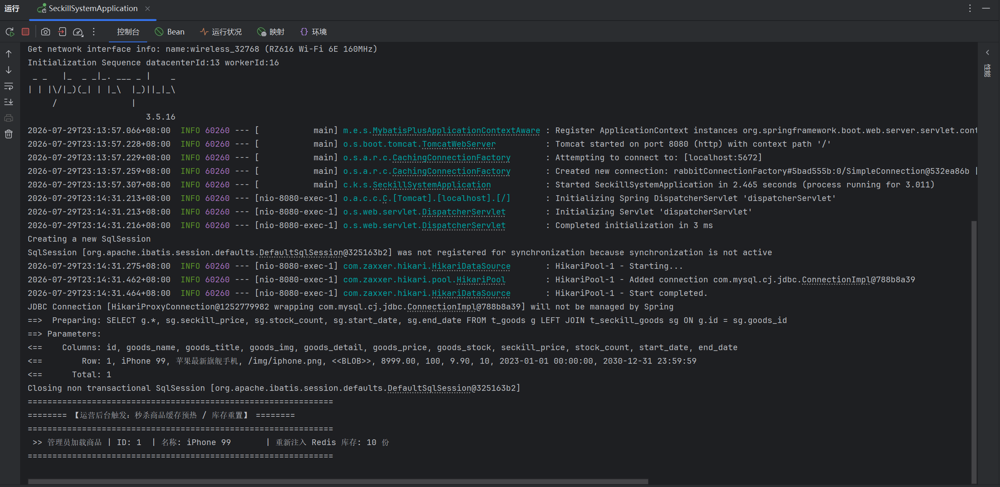
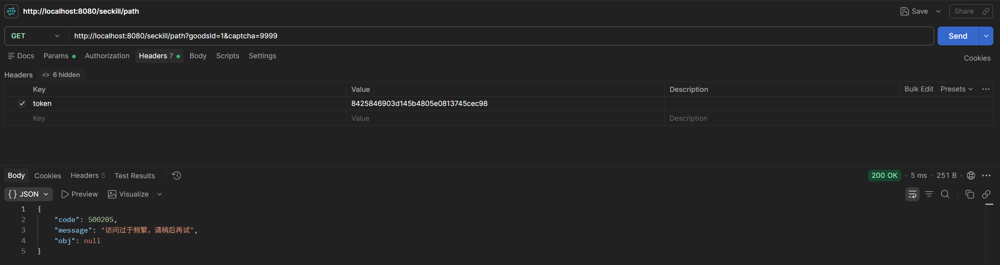
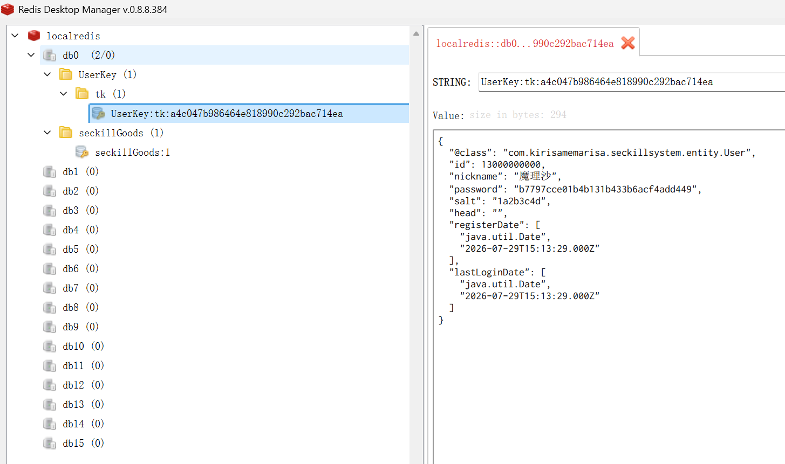

# V5.0 测试与检验报告 (接口限流、全局异常治理与 Redis 架构重构)

## 1. 测试背景与核心里程碑
经历了前面几个大版本的高并发与防伪拦截演进，系统底层已具备极强的抗压能力。但面向真实的生产环境，我们依然面临着工程化与系统防御的“最后一公里”痛点：
1. **报错不体面**：参数校验失败或内部异常时，Tomcat 会暴露出冗长的 500 错误页面，前端无法解析。
2. **防刷粒度不够**：虽然有验证码防重放，但恶意用户若使用脚本对某个单独接口（如抢路径接口）进行疯狂轮询，依然会消耗连接池。
3. **缓存维护灾难**：Redis 中的 Key 充斥着“魔法字符串”，不仅容易引发前缀冲突，还极难进行统一可视化管理和生命周期控制。

**本版本（V5.0）的核心目标**：通过引入 AOP 动态限流、全局异常接管以及模板方法设计模式，彻底将本系统拔高至 **“代码洁癖级规范”**与**“无死角防御”** 的企业级水准。

---

## 2. 第一阶段：全局异常治理与降级体验检验

### 2.1 拦截框架整合校验
以往，如果用户在登录接口传入格式错误的手机号，或者后端抛出自定义异常，控制台会狂刷 `RunTimeException` 堆栈，前端也会收到脱离业务语意的 HTTP 500 状态流。
引入 `@RestControllerAdvice` 结合 `@ExceptionHandler` 后，我们将所有异常进行了体面的收口。

### 2.2 测试表现：精准匹配 JSON 与纯净日志
模拟异常场景：向 `/user/login` 接口发送不合格的参数（例如传 `mobile: "130"`），主动触发 `@Valid` 校验拦截。
* **前端侧（Postman）**：系统成功拦截了格式错误，完美替换了 Tomcat 的报错页面，向前端返回了标准且友好的 JSON 响应体 `{"code": 500212, "message": "参数校验异常：手机号码格式不正确", "obj": null}`。
  
* **后端侧（控制台）**：后端 Spring Boot 彻底告别了满屏幕的血红色报错堆栈，将未知异常转化为受控异常。控制台清爽干净，大幅降低了运维排错时的日志信噪比。
  

---

## 3. 第二阶段：AOP 接口动态限流防刷测试

### 3.1 场景与限流阈值设定
为防止用户利用脚本使用合法 Token 在极短时间内疯狂刷量（如 1 秒内请求一百次隐藏路径接口），我们在控制器方法加上了自定义限流注解 `@AccessLimit(second = 5, maxCount = 5, needLogin = true)`。预期行为是：单一用户每 5 秒内最多只能访问该接口 5 次。

### 3.2 饱和攻击与熔断表现
* **测试动作**：利用 Postman，在 Headers 中携带合法的用户 Token，针对 `/seckill/path` 接口进行快速高频的点击重放测试。
* **熔断结果**：前 5 次请求均正常流转（若验证码错误则报验证码异常），但在第 6 次疯狂点击时，AOP 拦截器内的 Redis 固定窗口计数器精确察觉到了超限动作，底层直接熔断请求。
* 系统调用提前定义好的 `render` 方法，直接向客户端甩回 JSON：`{"code": 500205, "message": "访问过于频繁，请稍后再试"}`，成功将恶意流量在 Controller 外层就地正法。
  

---

## 4. 第三阶段：Redis 底层工程化重构验证

### 4.1 深入骨髓的重构（消灭魔法值）
在 V5.0 之前，系统代码里散落着诸如 `redisTemplate.opsForValue().set("seckill:path:" + userId, ...)` 这样的硬编码魔法字符串。
为了从根源上确立企业级项目的严谨性，本次深度引入了**“模板方法设计模式”**：定义了 `KeyPrefix` 接口与 `BasePrefix` 抽象类基座，将包括用户 Token、限流缓存、秒杀路径、验证码在内的缓存键，全部统一收拢至强类型的 OOP 对象中。

### 4.2 可视化空间降噪
* **测试动作**：运行整个登录及限流流程后，通过 Redis Desktop Manager 查看我们全新生成的数据。
* **观察成果**：得益于规范化的 `类名:前缀:` 拼接法则，Redis 客户端精准地将海量平铺的 Key 折叠并呈现为**极具观赏性的树状文件夹结构**（如 `UserKey -> tk -> 具体Token值`）。
* **工程学意义**：这种规范保证了后续哪怕数百个微服务同时接入同一个 Redis 集群，也绝不会发生 Key 覆写与冲突。运维人员对各业务数据的占比、内存使用率也能一目了然。
  

---

## 5. 架构演进总结

经过 V1.0 至 V5.0 长达五个大版本的狂飙突进，本秒杀系统的**后端核心基座**已宣告彻底大成。不仅攻克了高并发压测（JMeter）、解决了异步一致性，如今更是披上了全副武装的安全防刷铠甲，扫清了系统级别的代码坏味道。